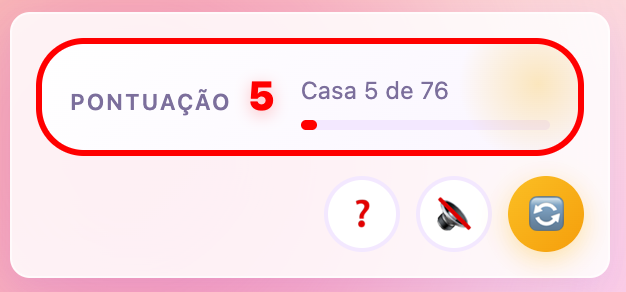
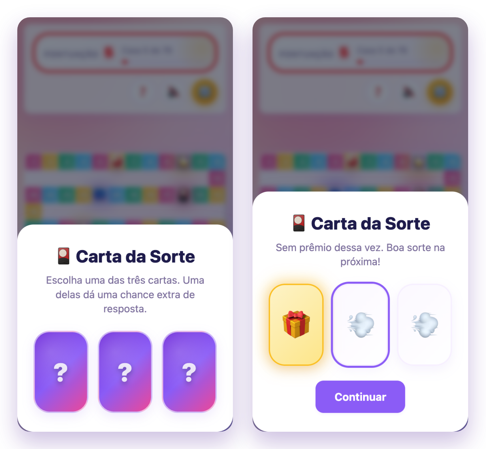
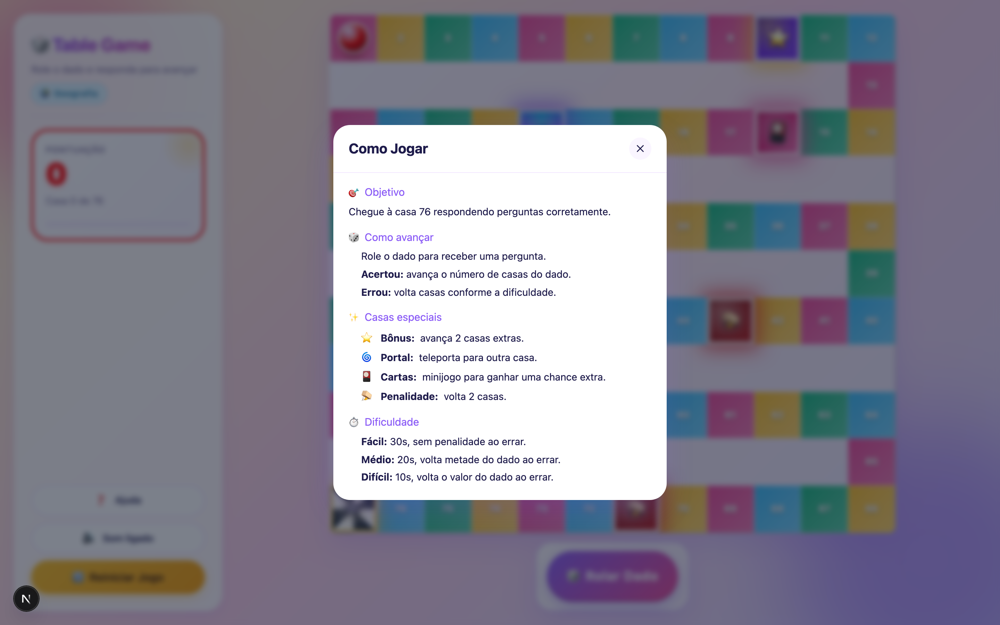
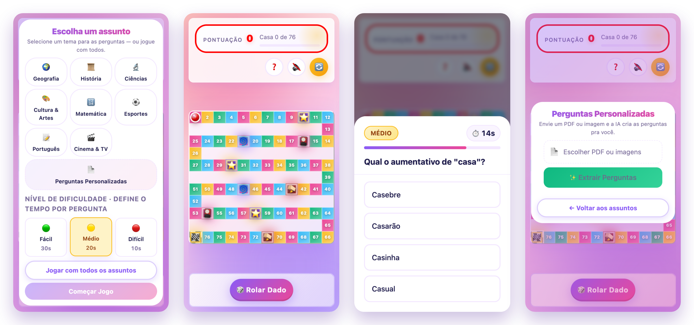

# O que é

- Um **jogo de tabuleiro** onde você avança respondendo perguntas de quiz
- Conteúdo pronto em 8 temas **ou** perguntas geradas por IA do seu próprio material
- Roda em **Web, iOS e Android** — mesma experiência

---

# Objetivo

- Percorra o caminho do tabuleiro respondendo perguntas
- **Acertar** te leva mais perto da chegada
- Cruze a **linha de chegada 🏁** no fim do percurso para vencer
- A barra de progresso na lateral mostra o quanto falta (**Casa X de 76**)

{ width=82% }

---

# 1. Tela inicial: escolha tema e dificuldade

- Selecione **um tema** ou jogue com **todos os assuntos**
- Ou envie um material e use **Perguntas Personalizadas** (IA)
- Escolha o **nível de dificuldade** — ele define o tempo por pergunta

{ width=62% }

---

# 2. Os 8 temas

160 perguntas em PT-BR, **20 por tema**:

- 🌍 Geografia — 📜 História — 🔬 Ciências
- 🎨 Cultura & Artes — 🔢 Matemática
- ⚽ Esportes — 📝 Português — 🎬 Cinema & TV

Prefere variar? Jogue com **todos os assuntos** misturados.

---

# 3. Perguntas personalizadas com IA

- Envie um **PDF** (apostila, simulado) ou uma **imagem** (slide, foto de quadro)
- A IA lê o material e **gera as perguntas** automaticamente
- Também cria um **tema/título** para a partida
- Antes de jogar, você confirma o que foi gerado
- Modelo: **Google Gemini 2.5 Flash**

{ width=56% }

---

# 4. Como jogar (passo a passo)

1. **Role o dado** (1 a 6)
2. Toque em **Ver Pergunta**
3. **Responda** dentro do tempo
4. **Acertou** → avança o número de casas do dado
5. **Errou** → retrocede conforme a dificuldade

{ width=64% }

---

# 5. O quiz e o cronômetro

- Múltipla escolha, com as **alternativas embaralhadas**
- **Cronômetro** com barra de tempo, indicado pela dificuldade
- O nível aparece como **selo** (Fácil / Médio / Difícil)
- **Tempo esgotado conta como erro**

{ width=56% }

---

# 6. Níveis de dificuldade

O nível define o **tempo** e a **penalidade ao errar** — acertar sempre avança o valor cheio do dado:

| Nível | Tempo | Penalidade ao errar |
|---|---|---|
| 🟢 Fácil | 30 s | Nenhuma — não retrocede |
| 🟡 Médio | 20 s | Volta **metade** do valor do dado |
| 🔴 Difícil | 10 s | Volta o **valor cheio** do dado |

---

# 7. Casas especiais

Espalhadas pelo caminho, mudam o rumo da partida:

- ⭐ **Bônus** — avança **2 casas** extras
- 🌀 **Portal** — teleporta para outra casa
- 🎴 **Cartas** — abre o minijogo da Carta da Sorte
- 🪤 **Penalidade** — volta **2 casas**

---

# 8. Carta da Sorte & chance extra

- Ao cair na casa 🎴, escolha **1 de 3 cartas**
- Uma delas dá uma **chance extra**
- Com a chance extra, no **próximo erro** você recebe uma **nova pergunta** em vez de retroceder
- Um aviso aparece no quiz quando a chance extra está ativa

{ width=54% }

---

# 9. Recursos de usabilidade

- **Feedback visual** imediato de acerto/erro
- **Animação casa a casa** com a câmera acompanhando o peão
- **Efeitos sonoros** (dado, acerto, erro, bônus, portal, vitória) — com botão de **mudo**
- Tela de **Ajuda ("Como Jogar")** sempre acessível

{ width=54% }

---

# 10. Vitória e recomeço

- Ao cruzar a linha de chegada: **confete** e tela de **vitória** 🎉
- Botão **Jogar Novamente** reinicia na hora
- Botão **Reiniciar Jogo** disponível a qualquer momento na lateral

---

# 11. Multiplataforma

- **Web** — roda em qualquer navegador
- **iOS** e **Android** — apps nativos via Capacitor
- Uma única base de código, a mesma jogabilidade em todos

---

# No celular (iOS e Android)

{ width=96% }

---

# Resumo / dicas rápidas

- Role, responda, avance — chegue à 🏁
- Escolha a dificuldade conforme o desafio (tempo e penalidade)
- Fique de olho nas **casas especiais**
- Guarde a **chance extra** para uma pergunta difícil

**Tiago** · tiago@grupoeureka.com.br
