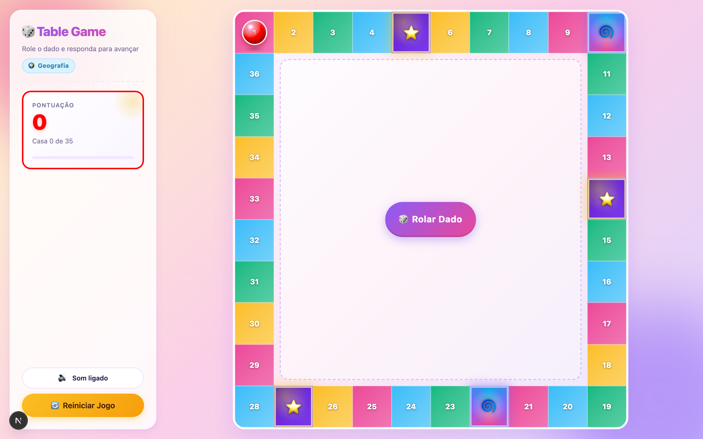
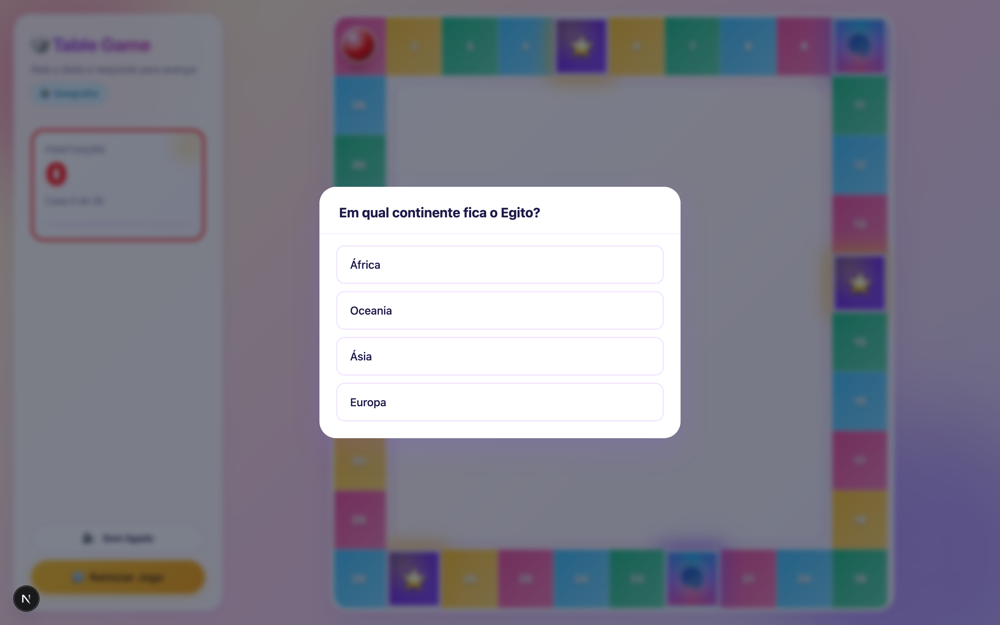
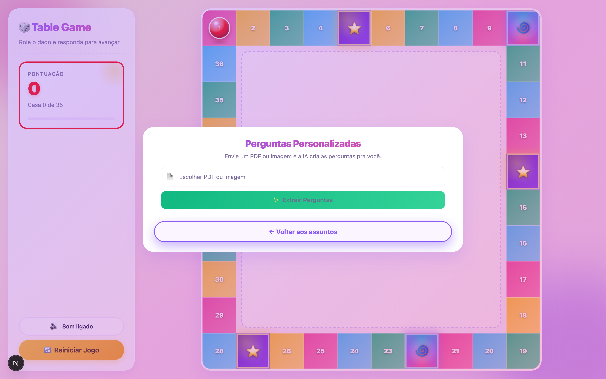
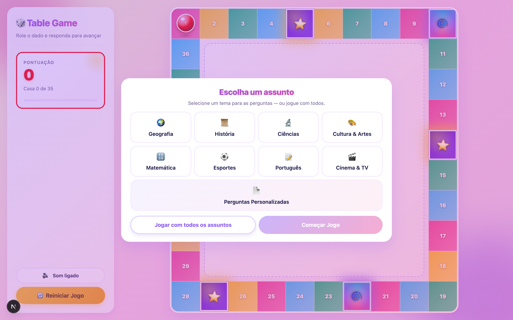

# Jogo de Tabuleiro Educacional com IA

Complemento gamificado para a sua plataforma educacional

---

# O problema

- Plataformas educacionais têm **conteúdo de sobra**, mas **engajamento baixo**
- Aluno consome material passivamente — não revisa, não fixa
- Produzir formato gamificado do zero é caro e lento

---

# A solução

Um **jogo de tabuleiro com IA** que transforma o conteúdo que a plataforma **já tem** em rodadas curtas de quiz.

Sem reproduzir material. Sem produção pedagógica extra.

{ width=70% }

---

# Como funciona em 30 segundos

1. Aluno rola o dado
2. Recebe uma pergunta do conteúdo da plataforma
3. **Acertou** → avança no tabuleiro
4. **Errou** → retrocede
5. Chegou à última casa → venceu

{ width=60% }

---

# O diferencial: IA que lê o material

- Sobe um **PDF** da apostila → IA extrai perguntas automaticamente
- Sobe uma **imagem** (slide, foto de quadro) → mesma coisa
- IA gera **título do tema** sozinha
- Validação automática descarta perguntas malformadas

{ width=60% }

Modelo: Google Gemini 2.5 Flash

---

# Multiplataforma sem custo extra

- **Web** — roda em qualquer navegador
- **iOS** — app nativo via Capacitor
- **Android** — app nativo via Capacitor

Uma única base de código. Uma única build.

---

# Banco de perguntas pronto

160 perguntas em PT-BR, 8 temas:

- Geografia (25) — História (20) — Ciências (20)
- Cultura & Artes (20) — Matemática (20)
- Esportes (20) — Português (20) — Cinema & TV (20)

{ width=60% }

---

# Valor para a plataforma

- **+ tempo de sessão** — gamificação aumenta engajamento
- **Reaproveita o conteúdo existente** — sem custo pedagógico extra
- **Diferenciação competitiva** — poucas EdTechs BR têm jogo nativo
- **Mobile incluído** — sem custo adicional de app

---

# Como integrar o conteúdo da plataforma

| # | Modo | Esforço |
|---|---|---|
| 1 | Upload manual (já funciona) | Zero |
| 2 | Banco JSON exportado | Baixo |
| 3 | API REST de ingestão | Médio |
| 4 | API + SSO da plataforma | Alto |
| 5 | Embed white-label | Baixo |
| 6 | LTI 1.3 (LMS) | Roadmap |

---

# Recomendação inicial

**Embed white-label + JSON exportado**

- UX integrada (jogo dentro da plataforma)
- Sem backend novo de nenhum lado
- Vai ao ar em **semanas**, não meses
- Base sólida para evoluir depois

---

# Roadmap conjunto de evolução

Oportunidades de upsell:

- **Multiplayer** com turnos
- **Persistência** de progresso por aluno
- **Painel de métricas** para professor
- **SSO** com a plataforma
- **Acessibilidade WCAG** completa

---

# Modelo comercial

Três caminhos para discussão:

- **(a) Licença anual flat** — recomendado para o piloto
- **(b) SaaS por aluno ativo/mês** — escala
- **(c) Revenue share** — parceria de longo prazo

Setup inicial cobrado à parte.

---

# Piloto de 60 dias

- **1 turma ou curso** da plataforma
- **Sem custo de licença** — apenas setup
- Medição de engajamento e retenção
- Comparação com grupo de controle

---

# Próximos passos

1. **Demo de 30 minutos** — usando uma apostila real da plataforma
2. **Reunião técnica** — escolher o modo de integração
3. **Piloto de 60 dias** — go!

---

# Obrigado

**Tiago — Grupo Eureka**

tiago@grupoeureka.com.br
